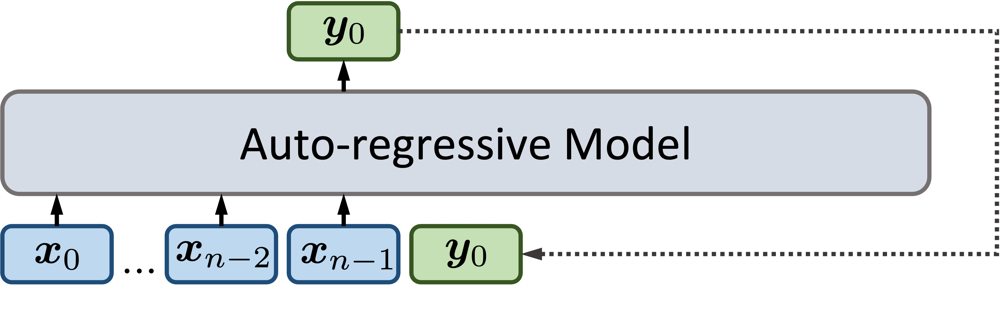
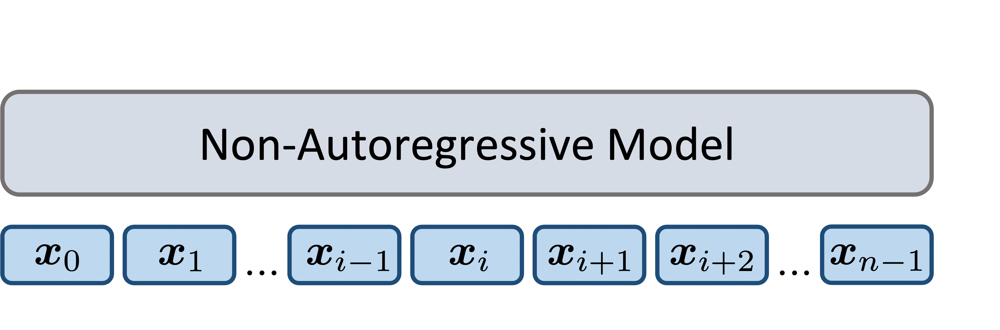
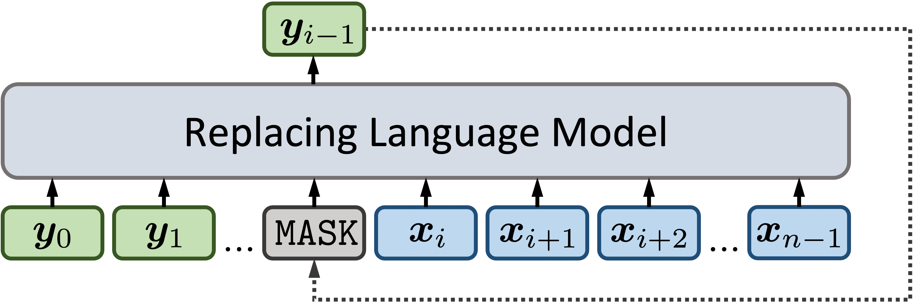

# Replacing Language Model

This repo contains the source code of the paper: [*Replacing Language Model for Style Transfer*](https://arxiv.org/abs/2211.07343). Our Replacing Language Model (RLM) is a novel sequence-to-sequence generation scheme, which gathers the flexibility of autoregressive models and the accuracy of non-autoregressive models.

- Autoregressive (AR) language models predict the next token based on the input sequence and the generated subsequence, which are flexible to rewrite sentences but difficult to control the content:

<p align="center">
  
 
  
</p>

- Non-autoregressive (NAR) models (especially masked language models) each time generate serveral parts of sentences, which are accurate to preserve the sentences' backbone but challenged by the generation diversity:

<p align="center">
   
</p>

- Our replacing language model (RLM)  autoregressively replaces
each token in the original sentence with a text span in the target style. In contrast,
the new span is generated via a non-autoregressive masked language model:

<p align="center">
   
</p>


## Dependencies

- pytorch=1.10
- huggingface=4.11.3
- nltk


## Data Preparation

First, download the raw datasets `Yelp` and `Amazon` from this [repo](https://github.com/lijuncen/Sentiment-and-Style-Transfer). The run the following command to convert data into `JSON` format and get the masked train data for RLM:
```bash
RAW_DATA_DIR=/directory/to/downloaded/raw/data
DATA_DIR=/directory/to/converted/data

python preprocess/preprocess.py\
       --raw_data_dir ${RAW_DATA_DIR}\
       --data_dir ${DATA_DIR}\
       --dataset "yelp"  # or Amazon
```

After preprocessing, you check the generated data files in the `${DATA_DIR}/yelp/` directory:
- `markers.json`: the style related words learned from the training set.
- `rare_word.json`: the low frequency words detected from the training set.
- `masked_train_data.json`: the masked training data set for learning the RLM model.

## Train the RLM
To train the replacing language model, run the following commands:

```bash
DATA_DIR=/directory/to/converted/data/yelp
SAVE_DIR=/directory/to/save/model

python main.py\
       --train_data_path ${DATA_DIR}/masked_train_data.json\
       --markers_path ${DATA_DIR}/markers.json\
       --rarewords_path ${DATA_DIR}/rare_words.json\
       --model_path bert-base-uncased\
       --tokenizer_path bert-base-uncased\
       --save_dir ${SAVE_DIR}
```


## Transfer Text Style

With a trained RLM model, to evaluate it performance on testing set, run the following commands:

```bash
DATA_DIR=/directory/to/converted/data/yelp
TEST_DATA_PATH=test/test_data.json
MODEL_PATH=/directory/to/save/model
OUTPUT_DIR=/directory/to/save/transfer/results

python main.py\
       --evaluate\
       --test_data_path ${TEST_DATA_PATH}\
       --markers_path ${DATA_DIR}/markers.json\
       --rarewords_path ${DATA_DIR}/rare_words.json\
       --model_path ${MODEL_PATH}\
       --tokenizer_path bert-base-uncased\
       --output_dir ${OUTPUT_DIR}
```
